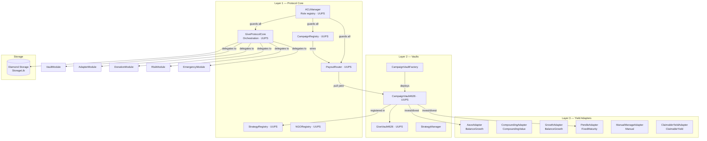
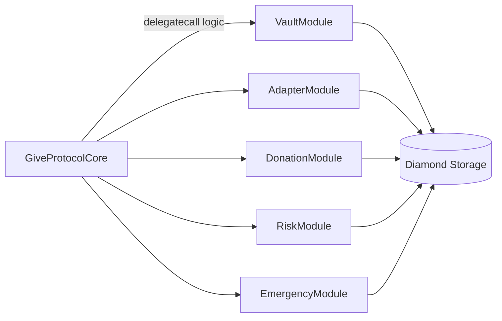
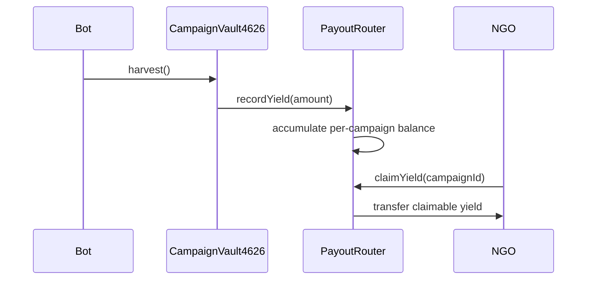
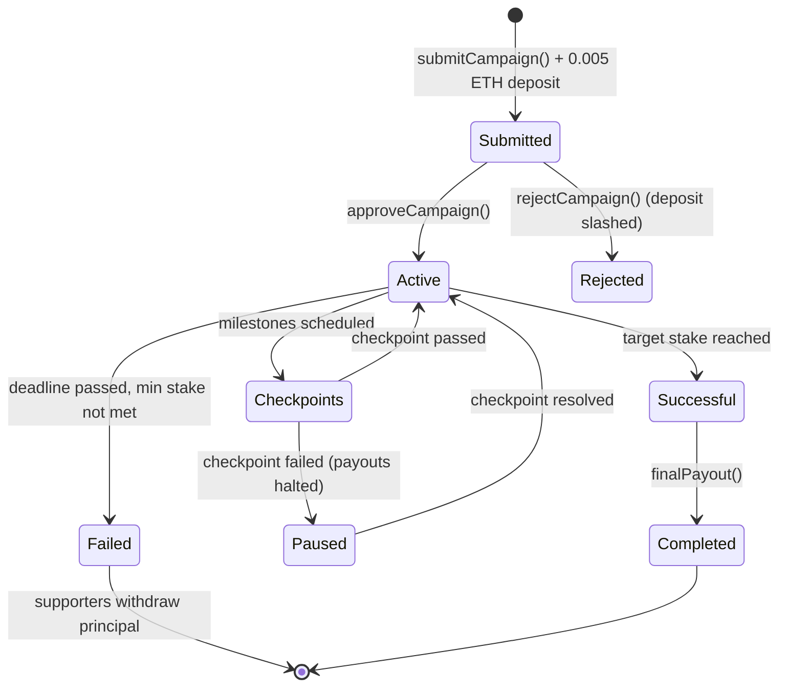
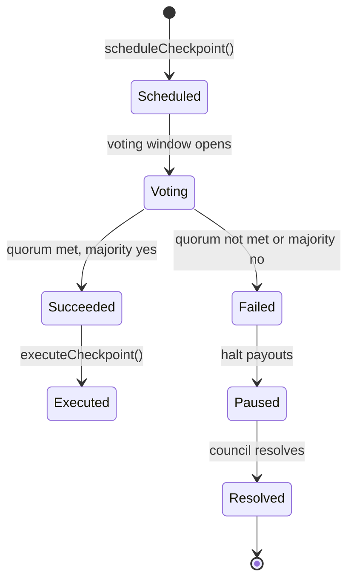
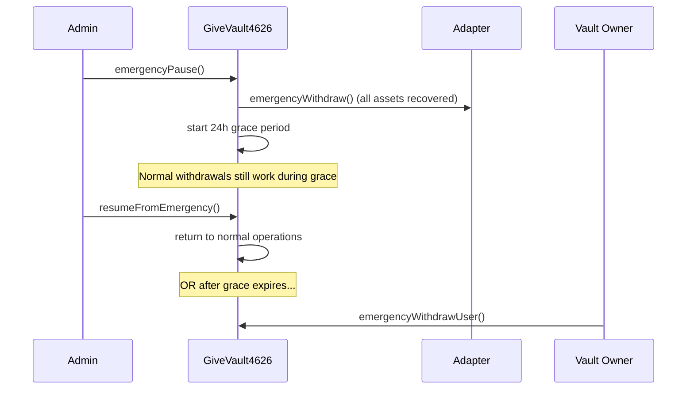
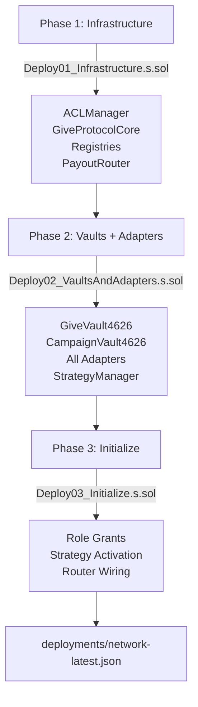

# GIVE Protocol V1

**No-loss donations powered by DeFi yield.**

Users stake assets → Yield flows to charities → Principal remains safe.

---

## How It Works

1. **Donor deposits** USDC into a campaign vault
2. **Vault invests** yield into DeFi protocols (Aave, Pendle, wstETH)
3. **Yield harvested** by vault → recorded in PayoutRouter
4. **Campaigns and NGOs claim** their yield share on-demand (pull model)
5. **Donors withdraw** their principal anytime, 100% intact

**Governance:** Supporters vote on campaign milestones via checkpoint voting. Failed checkpoints halt payouts until resolved.

---

## Architecture Overview

The protocol is organized across three layers:



---

## Contract Inventory

### Core (Layer 1)

| Contract           | Type | Purpose                                                      |
| ------------------ | ---- | ------------------------------------------------------------ |
| `ACLManager`       | UUPS | Centralized role registry with two-step admin transfer       |
| `GiveProtocolCore` | UUPS | Thin orchestration layer; delegates to six module libraries  |
| `StrategyRegistry` | UUPS | Yield strategy lifecycle: Active → FadingOut → Deprecated    |
| `CampaignRegistry` | UUPS | Campaign approval, checkpoint voting, supporter stake escrow |
| `NGORegistry`      | UUPS | Verified NGO registry with governance timelock               |
| `PayoutRouter`     | UUPS | Pull-based yield accumulator with fee timelock management    |

### Vaults (Layer 2)

| Contract               | Type   | Purpose                                                          |
| ---------------------- | ------ | ---------------------------------------------------------------- |
| `GiveVault4626`        | UUPS   | Base ERC-4626 vault with yield harvesting and emergency controls |
| `CampaignVault4626`    | UUPS   | Campaign-specific vault with fundraising limits                  |
| `CampaignVaultFactory` | Normal | Deploys `CampaignVault4626` as UUPS proxies                      |
| `StrategyManager`      | Normal | LTV, penalty, and cap parameter management                       |

### Adapters (Layer 3)

| Contract                | Kind                 | Protocol                                                   |
| ----------------------- | -------------------- | ---------------------------------------------------------- |
| `AaveAdapter`           | `BalanceGrowth`      | Aave V3 — aTokens grow autonomously                        |
| `CompoundingAdapter`    | `CompoundingValue`   | Generic compounding (sUSDe, cTokens)                       |
| `GrowthAdapter`         | `BalanceGrowth`      | Generic balance-growth pattern                             |
| `PendleAdapter`         | `FixedMaturityToken` | Pendle PT integration (standard and yield-bearing markets) |
| `PTAdapter`             | `FixedMaturityToken` | Principal token base                                       |
| `ClaimableYieldAdapter` | `ClaimableYield`     | Manual yield claiming (liquidity mining)                   |
| `ManualManageAdapter`   | `Manual`             | Operator-controlled off-chain positions                    |

### Module Libraries

Six stateless library modules delegate from `GiveProtocolCore`. All state is written through `StorageLib` into diamond storage.

| Module            | Responsibility                                   |
| ----------------- | ------------------------------------------------ |
| `VaultModule`     | Cash buffer, slippage, max loss configuration    |
| `AdapterModule`   | Adapter registration and validation              |
| `DonationModule`  | Donation routing and beneficiary management      |
| `RiskModule`      | LTV, liquidation thresholds, caps, risk profiles |
| `EmergencyModule` | Emergency pause, grace period, user withdrawal   |
| `SyntheticModule` | Synthetic position management                    |

---

## Key Design Patterns

### Diamond Storage

All protocol state lives in a single `GiveStorage.Store` struct, accessed exclusively through `StorageLib` helpers. This eliminates storage slot collisions across upgrades.

```solidity
// All contracts access state via typed accessors
StorageLib.vault(vaultId)            // returns VaultConfig storage ref
StorageLib.adapter(adapterId)        // returns AdapterConfig storage ref
StorageLib.ensureVaultActive(id)     // accessor + validation in one call
```

### Module Delegation

`GiveProtocolCore` is a thin router that delegates to pure library functions. Modules carry no state.



### Pull-Based PayoutRouter

Yield is never pushed to all recipients in a loop. The vault records harvested yield in `PayoutRouter`, and each campaign/NGO claims their share independently.



### Adapter Binding

Adapters are permanently bound to a single vault at deploy time via immutables. The `onlyVault` modifier enforces this binding on every operation.

```solidity
abstract contract AdapterBase {
    bytes32 immutable public adapterId;
    address immutable public adapterVault; // set once, never changes

    modifier onlyVault() {
        require(msg.sender == adapterVault, "only bound vault");
        _;
    }
}
```

---

## Campaign Lifecycle



### Checkpoint Governance



Supporters vote proportional to their staked share. Required quorum is configurable per campaign.

---

## Adapter Kinds

| Kind                 | How Yield Works                            | Example Protocols               |
| -------------------- | ------------------------------------------ | ------------------------------- |
| `CompoundingValue`   | Balance constant, exchange rate rises      | wstETH, sUSDe, Compound cTokens |
| `BalanceGrowth`      | Token balance grows over time              | Aave aTokens                    |
| `FixedMaturityToken` | PT tokens mature at face value             | Pendle PT                       |
| `ClaimableYield`     | Yield queued externally, claimed manually  | Liquidity mining rewards        |
| `Manual`             | Off-chain management, on-chain attestation | Structured products             |

---

## Role System

All access control flows through `ACLManager`. No standalone `Ownable`.

```
ROLE_SUPER_ADMIN          Root role, grants all others
ROLE_UPGRADER             Authorize UUPS upgrades
ROLE_PROTOCOL_ADMIN       Fees, treasury, protocol parameters
ROLE_STRATEGY_ADMIN       Register and update strategies
ROLE_CAMPAIGN_ADMIN       Approve and reject campaigns
ROLE_CAMPAIGN_CURATOR     Manage campaign stake escrow
ROLE_CHECKPOINT_COUNCIL   Resolve checkpoint status transitions
VAULT_MANAGER_ROLE        Configure vault adapters and settings
```

Two-step admin transfer prevents accidental privilege loss.

---

## Emergency Controls



---

## Development

### Setup

```bash
forge install
cp .env.example .env
forge build
forge test
```

### Project Structure

```
src/
├── governance/       ACLManager
├── core/             GiveProtocolCore
├── registry/         CampaignRegistry, StrategyRegistry
├── donation/         NGORegistry
├── vault/            GiveVault4626, CampaignVault4626, VaultTokenBase
├── factory/          CampaignVaultFactory
├── payout/           PayoutRouter
├── manager/          StrategyManager
├── adapters/         AaveAdapter, adapter kinds (6 types)
├── modules/          VaultModule, AdapterModule, DonationModule,
│                     RiskModule, EmergencyModule, SyntheticModule
├── storage/          GiveStorage, StorageLib, StorageKeys
├── types/            GiveTypes (canonical structs and enums)
├── interfaces/       IACLManager, IYieldAdapter, IWETH
├── utils/            GiveErrors, ACLShim
└── mocks/            MockERC20, MockAavePool, MockYieldAdapter

test/
├── base/             Base01–Base03 (3-phase deployment fixtures)
├── unit/             TestContract01–21 (21 unit test suites)
├── integration/      TestAction01–02 (end-to-end workflows)
├── fork/             ForkTest01–09 (9 live protocol tests)
├── fuzz/             FuzzTest01–04 (property-based tests)
└── invariant/        InvariantTest01–03 + 3 handlers

script/
├── base/             BaseDeployment (JSON persistence, network detection)
├── Deploy01_Infrastructure.s.sol    Phase 1: Core + registries
├── Deploy02_VaultsAndAdapters.s.sol Phase 2: Vaults + adapters
├── Deploy03_Initialize.s.sol        Phase 3: Roles + strategies
├── Upgrade.s.sol                    UUPS upgrade helper
└── operations/
    └── deploy_local_all.sh          Full local deployment orchestration

frontend/
├── test/
│   ├── e2e.test.ts                  Main Vitest runner
│   └── e2e/
│       ├── context.ts               Client setup and deployment loading
│       ├── TestAction00_*.ts        Environment + campaign lifecycle
│       ├── TestAction01_*.ts        Deposit, preference, harvest
│       ├── TestAction02_*.ts        Payout, withdrawal, invariants
│       └── TestAction03_*.ts        Access control + revert paths
├── scripts/
│   ├── viem-smoke.mjs               Lightweight smoke test (local/rpc/fork)
│   └── fork-smoke.sh                Fork Anvil + full lifecycle
├── setup.ts                         Viem client initialization
└── vitest.config.ts

config/
└── chains/
    ├── base.json                    Base mainnet (USDC, Aave, wstETH, Pendle)
    ├── arbitrum.json
    ├── optimism.json
    └── local.json

deployments/
├── anvil-latest.json
├── base-mainnet-latest.json
└── [timestamped archives]
```

---

## Testing

### Test Suite Structure

| Category        | Directory           | Files          | Purpose                                                                    | Naming                       |
| --------------- | ------------------- | -------------- | -------------------------------------------------------------------------- | ---------------------------- |
| **Base**        | `test/base/`        | 3              | Deployment fixtures, 3-phase provisioning                                  | `Base0{1,2,3}_Deploy*.t.sol` |
| **Unit**        | `test/unit/`        | 21             | Single-contract functionality                                              | `TestContract{NN}_*.t.sol`   |
| **Integration** | `test/integration/` | 2              | Full workflow cycles                                                       | `TestAction{NN}_*.t.sol`     |
| **Fork**        | `test/fork/`        | 11             | Live protocol interactions + critical-path upgrade validation on Base fork | `ForkTest{NN}_*.fork.t.sol`  |
| **Fuzz**        | `test/fuzz/`        | 4              | Stateless property testing                                                 | `FuzzTest{NN}_*.t.sol`       |
| **Invariant**   | `test/invariant/`   | 3 + 3 handlers | Multi-step protocol invariants                                             | `InvariantTest{NN}_*.t.sol`  |

### Quick Reference

```bash
# Default: unit + integration
forge test -v

# By category
forge test --match-path "test/unit/**" -v
forge test --match-path "test/integration/**" -v
forge test --match-path "test/fork/**" --fork-url $BASE_RPC_URL -v
forge test --match-path "test/fuzz/**" -v --fuzz-seed 0x1337
forge test --match-path "test/invariant/**" -v

# Profiles
FOUNDRY_PROFILE=full forge test              # All suites
FOUNDRY_PROFILE=fork forge test              # Fork only
FOUNDRY_PROFILE=fuzz forge test              # Fuzz only
FOUNDRY_PROFILE=invariant forge test         # Invariant only

# Coverage (unit + integration, no fork/fuzz/invariant)
FOUNDRY_PROFILE=coverage forge coverage --ir-minimum --report summary \
  --no-match-path "test/fork/**:test/fuzz/**:test/invariant/**"

# Specific test
forge test --match-contract TestContract01_ACLManager -v
forge test --match-test test_Case01_deploymentState -v
```

> `--ir-minimum` is permanently required. OZ's `__ERC20_init` uses inline assembly
> that hits the 16-slot stack limit when `optimizer=false, via_ir=false`.

### Coverage Targets

| Contract      | Lines  | Statements | Branches   | Functions |
| ------------- | ------ | ---------- | ---------- | --------- |
| Overall       | 60.43% | 61.00%     | **49.23%** | 62.62%    |
| PayoutRouter  | 88.72% | 88.85%     | **87.80%** | 88.10%    |
| GiveVault4626 | 78.79% | 81.07%     | **83.05%** | 71.70%    |

### Test Count

- **Unit + Integration (default run):** 428+ tests, 0 failed, 0 skipped
- **Fork:** 11 suites (AaveAdapter, Pendle yoUSD/yoETH + maturity, checkpoint voting, multi-vault, campaign lifecycle, depositETH, fork sanity, and critical-path upgrade fork checks via `ForkTest11_UpgradeCriticalPaths`)
- **Fuzz:** 4 suites (10,000 runs each)
- **Invariant:** 3 suites (256 runs, depth 500)

### Frontend E2E (Viem + Vitest)

The frontend E2E suite runs against any configured RPC. It completely replaces `.s.sol` operation scripts for lifecycle validation.

```bash
# Run strict E2E suite (primary command)
make vitest

# Override target network/RPC
make frontend-e2e RPC_URL=... DEPLOYMENT_NETWORK=anvil
```

**Test actions:**

| File           | Scope                                                                                     |
| -------------- | ----------------------------------------------------------------------------------------- |
| `TestAction00` | Environment initialization, role grants, campaign submission + approval, vault deployment |
| `TestAction01` | USDC approval, deposit, time travel (30 days), yield harvest, preference config           |
| `TestAction02` | Payout execution, share redemption, principal return, invariant assertions                |
| `TestAction03` | Unauthorized access rejections, revert selector validation                                |

**Current status: 56/56 passing on BuildBear (strict runtime).**

---

## Deployment

### Three-Phase Deployment



### Local Development

```bash
# Full local deploy (Anvil must be running)
bash script/operations/deploy_local_all.sh

# Or via Make
make deploy-local
```

### Testnet / Mainnet

```bash
# Phase 1
forge script script/Deploy01_Infrastructure.s.sol \
  --rpc-url $BASE_RPC_URL --private-key $PRIVATE_KEY \
  --broadcast --verify

# Phase 2
forge script script/Deploy02_VaultsAndAdapters.s.sol \
  --rpc-url $BASE_RPC_URL --private-key $PRIVATE_KEY \
  --broadcast --verify

# Phase 3
forge script script/Deploy03_Initialize.s.sol \
  --rpc-url $BASE_RPC_URL --private-key $PRIVATE_KEY \
  --broadcast
```

### Upgrade Contracts

```bash
forge script script/Upgrade.s.sol \
  --sig "upgradeACLManager()" \
  --rpc-url $BASE_RPC_URL --private-key $PRIVATE_KEY \
  --broadcast --verify
```

### Deployment Artifacts

All deployments are saved to `deployments/{network}-latest.json` and a timestamped archive. The frontend E2E suite reads these automatically via `DEPLOYMENT_NETWORK` or `DEPLOYMENTS_FILE`.

---

## Static Analysis

Slither is managed via `uv` (Python). Dependencies are declared in `pyproject.toml`.

**Prerequisites:** `uv` — install from [docs.astral.sh/uv](https://docs.astral.sh/uv/getting-started/installation/)

```bash
# Install slither into the project virtualenv (first time only)
make slither-install

# Full report — writes slither-report.json
make slither

# Triage mode — High + Medium detectors only, no JSON output
make slither-triage

# Semgrep (no install needed if semgrep is on PATH)
semgrep --config auto src/
```

Or run directly:

```bash
uv run slither . \
  --compile-force-framework foundry \
  --filter-paths "lib/,node_modules/" \
  --exclude-dependencies \
  --json slither-report.json
```

**Slither findings — full run, all triaged (see `slither/slither-findings.md`):**

| Severity      | Count | Accepted |
| ------------- | ----- | -------- |
| High          | 2     | 0        |
| Medium        | 11    | 0        |
| Low           | 8     | 0        |
| Informational | 6     | 0        |

All 27 grouped findings are dismissed as false positives, intentional patterns, or mock-only code. No code changes required.

---

## Environment

Copy `.env.example` and fill in required values.

**Required for local dev:**

```
PRIVATE_KEY              Deployer/admin signer
USER_PRIVATE_KEY         Test user signer
USDC_ADDRESS             Deployed or mock USDC address
BASE_RPC_URL             RPC endpoint
```

**Pendle adapter (Deploy02_VaultsAndAdapters.s.sol):**

```
PENDLE_ROUTER_ADDRESS    0x888888888889758F76e7103c6CbF23ABbF58F946 (same on all chains)
PENDLE_MARKET_ADDRESS    Pendle market address for the chosen PT
PENDLE_PT_ADDRESS        Principal token address
PENDLE_TOKEN_OUT_ADDRESS SY redemption token. Set to USDC for standard markets (PT-aUSDC).
                         Set to yoUSD / yoETH for yield-bearing markets. Defaults to USDC
                         when unset.
```

Yield-bearing Pendle markets (PT-yoUSD, PT-yoETH) have a SY that accepts USDC/WETH as
deposit input but only releases its own underlying (yoUSD/yoETH) on redemption. The
`tokenOut_` constructor parameter on `PendleAdapter` must match the SY's `getTokensOut()`
list — passing the wrong token causes `SYInvalidTokenOut`.

```bash
# Verify correct tokenOut for a market's SY
cast call <SY_ADDRESS> "getTokensOut()(address[])" --rpc-url $BASE_RPC_URL
```

**Known Base mainnet Pendle markets:**

| Market   | Asset in | Token out                   | Market address      |
| -------- | -------- | --------------------------- | ------------------- |
| PT-yoUSD | USDC     | yoUSD (`0x0000000f2eB9...`) | `0xA679ce6D07cb...` |
| PT-yoETH | WETH     | yoETH (`0x3A43AEC534...`)   | `0x5d6E67FcE4...`   |

**Required for frontend E2E:**

```
DEPLOYMENT_NETWORK       e.g. anvil, base-mainnet
DEPLOYMENTS_FILE         Explicit path override (optional)
EXPECTED_CHAIN_ID        Validation guard (optional)
```

**Protocol parameters:**

```
PROTOCOL_FEE_BPS         100 = 1%
ALLOW_DEFAULT_BROADCAST  false (require explicit signer)
AUTO_REBALANCE_ENABLED   true
REBALANCE_INTERVAL       86400 (1 day in seconds)
```

---

## Mandatory Deployment Gates

Before mainnet deployment, all of the following must pass:

1. `forge test -v` — zero failures
2. PayoutRouter pull accumulator model is active (no push loops)
3. Slither + Semgrep triaged with no unaccepted High findings
4. Fuzz and invariant suites exist and pass
5. Fork suites pass for live Base mainnet assumptions
6. Frontend E2E strict suite: 56/56 passing on target network

---

## Stack

- **Solidity** `0.8.34`, EVM target: `prague`
- **Foundry** — build, test, deploy, coverage
- **OpenZeppelin v5** — UUPS, ERC-4626, AccessControl
- **UUPS proxies** — all core and vault contracts
- **Diamond Storage** — collision-safe upgradeable state
- **Viem v2 + Vitest v4** — frontend E2E and smoke tests
- **Target mainnet:** Base

---

## License

MIT
