# GIVE Protocol V1

**No-loss donations powered by DeFi yield.**

Users stake assets → Yield flows to charities → Principal remains safe.

---

## Stack

- **Solidity** `0.8.34`, EVM target: `prague`
- **Foundry** — build, test, deploy, coverage
- **OpenZeppelin v5** — UUPS, ERC-4626, AccessControl
- **UUPS proxies** — all core and vault contracts
- **Diamond Storage** — collision-safe upgradeable state
- **Viem v2 + Vitest v4** — frontend E2E and smoke tests
- **Target mainnet:** Base

---

## How It Works

1. **Donor deposits** Assets into a campaign vault
2. **Vault invests** yield into DeFi protocols (Aave, Pendle, wstETH)
3. **Yield harvested** by vault → recorded in PayoutRouter
4. **Campaigns and NGOs claim** their yield share on-demand (pull model)
5. **Donors withdraw** their principal anytime, 100% intact

**Governance:** Supporters vote on campaign milestones via checkpoint voting. Failed checkpoints halt payouts until resolved.

---

## Architecture Overview

The protocol is organized across three layers:

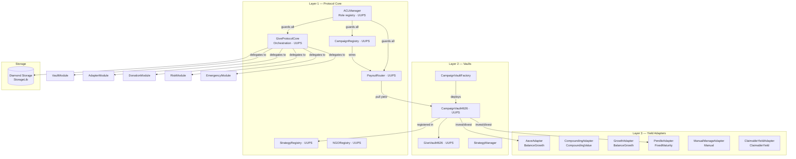
```mermaid
graph TD
    subgraph "Layer 1 — Protocol Core"
        ACL[ACLManager<br/>Role registry · UUPS]
        Core[GiveProtocolCore<br/>Orchestration · UUPS]
        SR[StrategyRegistry · UUPS]
        CR[CampaignRegistry · UUPS]
        NGOR[NGORegistry · UUPS]
        PR[PayoutRouter · UUPS]
    end

    subgraph "Layer 2 — Vaults"
        VF[CampaignVaultFactory]
        CV[CampaignVault4626 · UUPS]
        GV[GiveVault4626 · UUPS]
        SM[StrategyManager]
    end

    subgraph "Layer 3 — Yield Adapters"
        AA[AaveAdapter<br/>BalanceGrowth]
        CA[CompoundingAdapter<br/>CompoundingValue]
        GA[GrowthAdapter<br/>BalanceGrowth]
        PA[PendleAdapter<br/>FixedMaturity]
        MA[ManualManageAdapter<br/>Manual]
        CY[ClaimableYieldAdapter<br/>ClaimableYield]
    end

    subgraph "Storage"
        DS[(Diamond Storage<br/>StorageLib)]
    end

    Core -->|delegates to| VaultModule
    Core -->|delegates to| AdapterModule
    Core -->|delegates to| DonationModule
    Core -->|delegates to| RiskModule
    Core -->|delegates to| EmergencyModule
    Core --> DS

    VF -->|deploys| CV
    CV --> GV
    CV -->|registered in| SR
    CV -->|invest/divest| AA
    CV -->|invest/divest| PA
    PR -->|pull yield| CV
    CR -->|wires| PR
    ACL -->|guards all| Core
    ACL -->|guards all| PR
    ACL -->|guards all| CR
```

---

## Integration Flow

End-to-end sequence from campaign setup through yield payout. Shows every cross-contract call in the happy path.

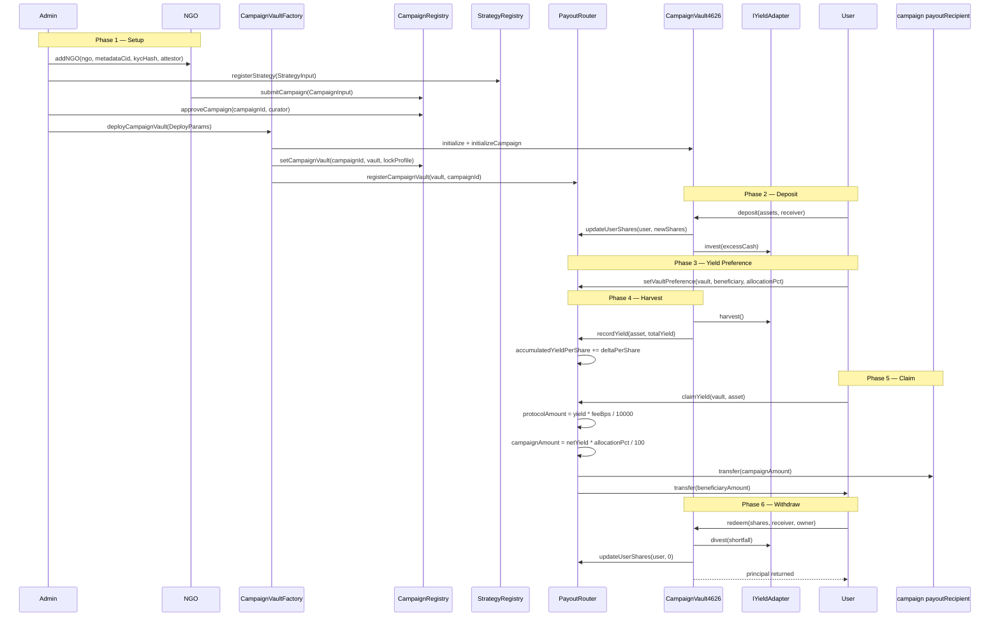
```mermaid
sequenceDiagram
    participant Admin
    participant NGO
    participant Factory as CampaignVaultFactory
    participant CR as CampaignRegistry
    participant SR as StrategyRegistry
    participant PR as PayoutRouter
    participant Vault as CampaignVault4626
    participant Adapter as IYieldAdapter
    participant User
    participant Campaign as campaign payoutRecipient

    Note over Admin, NGO: Phase 1 — Setup
    Admin->>NGO: addNGO(ngo, metadataCid, kycHash, attestor)
    Admin->>SR: registerStrategy(StrategyInput)
    NGO->>CR: submitCampaign(CampaignInput)
    Admin->>CR: approveCampaign(campaignId, curator)
    Admin->>Factory: deployCampaignVault(DeployParams)
    Factory->>Vault: initialize + initializeCampaign
    Factory->>CR: setCampaignVault(campaignId, vault, lockProfile)
    Factory->>PR: registerCampaignVault(vault, campaignId)

    Note over User, Vault: Phase 2 — Deposit
    User->>Vault: deposit(assets, receiver)
    Vault->>PR: updateUserShares(user, newShares)
    Vault->>Adapter: invest(excessCash)

    Note over User, PR: Phase 3 — Yield Preference
    User->>PR: setVaultPreference(vault, beneficiary, allocationPct)

    Note over Vault, PR: Phase 4 — Harvest
    Vault->>Adapter: harvest()
    Vault->>PR: recordYield(asset, totalYield)
    PR->>PR: accumulatedYieldPerShare += deltaPerShare

    Note over User, Campaign: Phase 5 — Claim
    User->>PR: claimYield(vault, asset)
    PR->>PR: protocolAmount = yield * feeBps / 10000
    PR->>PR: campaignAmount = netYield * allocationPct / 100
    PR->>Campaign: transfer(campaignAmount)
    PR->>User: transfer(beneficiaryAmount)

    Note over User, Vault: Phase 6 — Withdraw
    User->>Vault: redeem(shares, receiver, owner)
    Vault->>Adapter: divest(shortfall)
    Vault->>PR: updateUserShares(user, 0)
    Vault-->>User: principal returned
```

---

## Contract Inventory

Each layer below includes a contract table followed by individual component flows showing exact function calls.

---

### Layer 1 — Protocol Core

| Contract           | Type | Purpose                                                      |
| ------------------ | ---- | ------------------------------------------------------------ |
| `ACLManager`       | UUPS | Centralized role registry with two-step admin transfer       |
| `GiveProtocolCore` | UUPS | Thin orchestration layer; delegates to six module libraries  |
| `StrategyRegistry` | UUPS | Yield strategy lifecycle: Active → FadingOut → Deprecated    |
| `CampaignRegistry` | UUPS | Campaign approval, checkpoint voting, supporter stake escrow |
| `NGORegistry`      | UUPS | Verified NGO registry with governance timelock               |
| `PayoutRouter`     | UUPS | Pull-based yield accumulator with fee timelock management    |

#### ACLManager

Centralized role registry for the entire protocol. All contracts read roles from here; no contract uses standalone `Ownable`. Role admin transfers use a two-step propose/accept pattern to prevent accidental privilege loss.

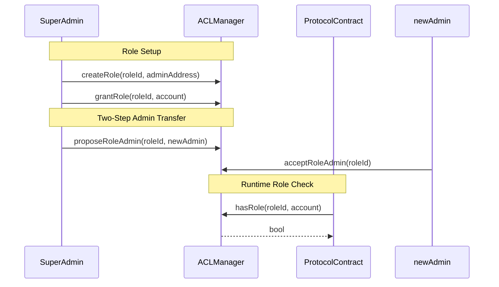
```mermaid
sequenceDiagram
    participant SuperAdmin
    participant ACL as ACLManager
    participant ProtocolContract

    Note over SuperAdmin, ACL: Role Setup
    SuperAdmin->>ACL: createRole(roleId, adminAddress)
    SuperAdmin->>ACL: grantRole(roleId, account)

    Note over SuperAdmin, ACL: Two-Step Admin Transfer
    SuperAdmin->>ACL: proposeRoleAdmin(roleId, newAdmin)
    newAdmin->>ACL: acceptRoleAdmin(roleId)

    Note over ProtocolContract, ACL: Runtime Role Check
    ProtocolContract->>ACL: hasRole(roleId, account)
    ACL-->>ProtocolContract: bool
```

**Key roles:**

```
ROLE_SUPER_ADMIN          Root role, grants all others
ROLE_UPGRADER             Authorize UUPS upgrades
ROLE_PROTOCOL_ADMIN       Fees, treasury, protocol parameters
ROLE_STRATEGY_ADMIN       Register and update strategies
ROLE_CAMPAIGN_ADMIN       Approve and reject campaigns
ROLE_CAMPAIGN_CURATOR     Manage campaign stake escrow
ROLE_CHECKPOINT_COUNCIL   Resolve checkpoint status transitions
```

Source: `src/governance/ACLManager.sol`

#### UUPS Upgrade Flow

All upgradeable contracts use the same pattern: `ROLE_UPGRADER` is checked via `ACLManager` inside `_authorizeUpgrade`, then the OZ UUPS proxy routes to the new implementation. Adapters are **not** upgradeable — they are immutably bound to a vault at deploy time.

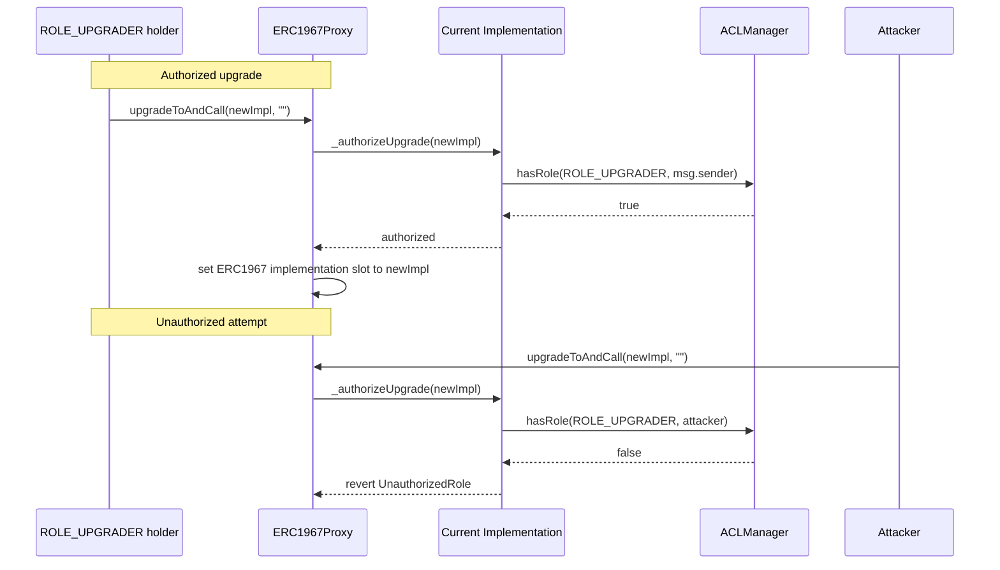
```mermaid
sequenceDiagram
    participant Upgrader as ROLE_UPGRADER holder
    participant Proxy as ERC1967Proxy
    participant OldImpl as Current Implementation
    participant ACL as ACLManager

    Note over Upgrader, Proxy: Authorized upgrade
    Upgrader->>Proxy: upgradeToAndCall(newImpl, "")
    Proxy->>OldImpl: _authorizeUpgrade(newImpl)
    OldImpl->>ACL: hasRole(ROLE_UPGRADER, msg.sender)
    ACL-->>OldImpl: true
    OldImpl-->>Proxy: authorized
    Proxy->>Proxy: set ERC1967 implementation slot to newImpl

    Note over Upgrader, Proxy: Unauthorized attempt
    Attacker->>Proxy: upgradeToAndCall(newImpl, "")
    Proxy->>OldImpl: _authorizeUpgrade(newImpl)
    OldImpl->>ACL: hasRole(ROLE_UPGRADER, attacker)
    ACL-->>OldImpl: false
    OldImpl-->>Proxy: revert UnauthorizedRole
```

Source: `_authorizeUpgrade` in each contract above

#### NGORegistry

Verified registry of approved NGOs. Each NGO entry holds KYC metadata, donation history, and a delegate allowlist for campaign submission. `currentNGO` changes use a timelock governed by `ROLE_PROTOCOL_ADMIN`; `emergencySetCurrentNGO` bypasses the timelock for incident response.

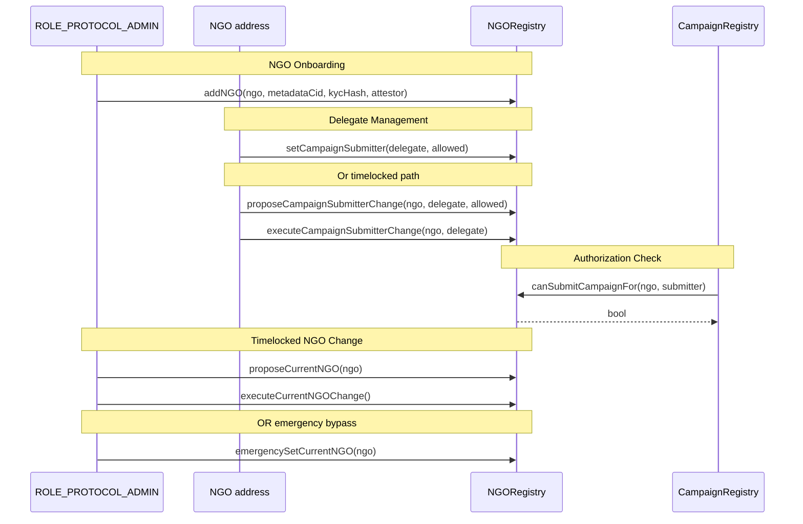
```mermaid
sequenceDiagram
    participant Admin as ROLE_PROTOCOL_ADMIN
    participant NGO as NGO address
    participant NGOR as NGORegistry
    participant CampaignReg as CampaignRegistry

    Note over Admin, NGOR: NGO Onboarding
    Admin->>NGOR: addNGO(ngo, metadataCid, kycHash, attestor)

    Note over NGO, NGOR: Delegate Management
    NGO->>NGOR: setCampaignSubmitter(delegate, allowed)
    Note over NGO, NGOR: Or timelocked path
    NGO->>NGOR: proposeCampaignSubmitterChange(ngo, delegate, allowed)
    NGO->>NGOR: executeCampaignSubmitterChange(ngo, delegate)

    Note over CampaignReg, NGOR: Authorization Check
    CampaignReg->>NGOR: canSubmitCampaignFor(ngo, submitter)
    NGOR-->>CampaignReg: bool

    Note over Admin, NGOR: Timelocked NGO Change
    Admin->>NGOR: proposeCurrentNGO(ngo)
    Admin->>NGOR: executeCurrentNGOChange()
    Note over Admin, NGOR: OR emergency bypass
    Admin->>NGOR: emergencySetCurrentNGO(ngo)
```

Source: `src/donation/NGORegistry.sol`

#### StrategyRegistry

Lifecycle registry for yield strategies. A strategy groups an adapter type, target asset, and metadata hash for off-chain validation. Vaults only interact with strategies in `Active` or `FadingOut` status.

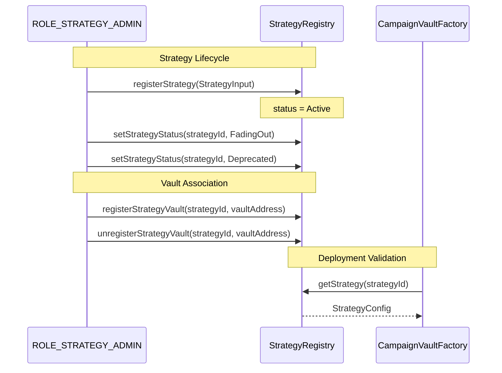
```mermaid
sequenceDiagram
    participant StratAdmin as ROLE_STRATEGY_ADMIN
    participant SR as StrategyRegistry
    participant Factory as CampaignVaultFactory

    Note over StratAdmin, SR: Strategy Lifecycle
    StratAdmin->>SR: registerStrategy(StrategyInput)
    Note over SR: status = Active
    StratAdmin->>SR: setStrategyStatus(strategyId, FadingOut)
    StratAdmin->>SR: setStrategyStatus(strategyId, Deprecated)

    Note over StratAdmin, SR: Vault Association
    StratAdmin->>SR: registerStrategyVault(strategyId, vaultAddress)
    StratAdmin->>SR: unregisterStrategyVault(strategyId, vaultAddress)

    Note over Factory, SR: Deployment Validation
    Factory->>SR: getStrategy(strategyId)
    SR-->>Factory: StrategyConfig
```

```
Active → FadingOut → Deprecated
```

Source: `src/registry/StrategyRegistry.sol`

#### CampaignRegistry

Manages the full campaign lifecycle: submission, approval, checkpoint governance, and supporter stake escrow. Payouts via `PayoutRouter` are halted when a checkpoint fails and resume only after council resolution.

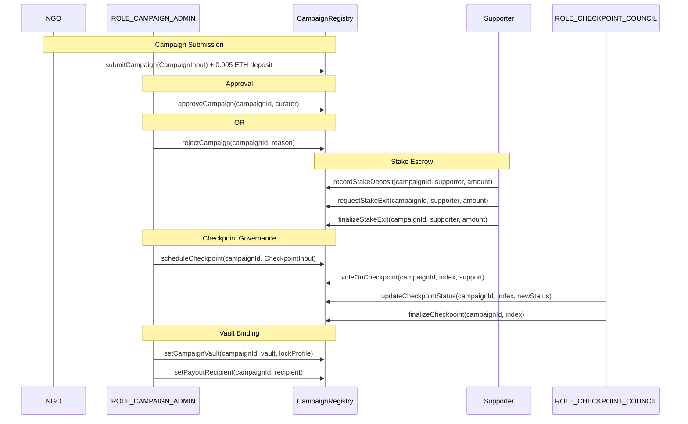
```mermaid
sequenceDiagram
    participant NGO
    participant CampaignAdmin as ROLE_CAMPAIGN_ADMIN
    participant CR as CampaignRegistry
    participant Supporter
    participant Council as ROLE_CHECKPOINT_COUNCIL

    Note over NGO, CR: Campaign Submission
    NGO->>CR: submitCampaign(CampaignInput) + 0.005 ETH deposit

    Note over CampaignAdmin, CR: Approval
    CampaignAdmin->>CR: approveCampaign(campaignId, curator)
    Note over CampaignAdmin, CR: OR
    CampaignAdmin->>CR: rejectCampaign(campaignId, reason)

    Note over Supporter, CR: Stake Escrow
    Supporter->>CR: recordStakeDeposit(campaignId, supporter, amount)
    Supporter->>CR: requestStakeExit(campaignId, supporter, amount)
    Supporter->>CR: finalizeStakeExit(campaignId, supporter, amount)

    Note over CampaignAdmin, CR: Checkpoint Governance
    CampaignAdmin->>CR: scheduleCheckpoint(campaignId, CheckpointInput)
    Supporter->>CR: voteOnCheckpoint(campaignId, index, support)
    Council->>CR: updateCheckpointStatus(campaignId, index, newStatus)
    Council->>CR: finalizeCheckpoint(campaignId, index)

    Note over CampaignAdmin, CR: Vault Binding
    CampaignAdmin->>CR: setCampaignVault(campaignId, vault, lockProfile)
    CampaignAdmin->>CR: setPayoutRecipient(campaignId, recipient)
```

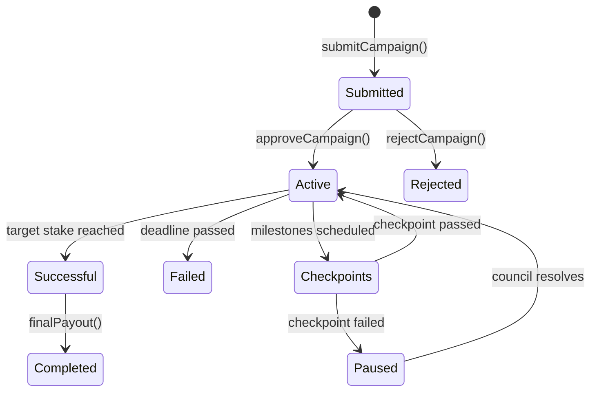
```mermaid
stateDiagram-v2
    [*] --> Submitted: submitCampaign()
    Submitted --> Active: approveCampaign()
    Submitted --> Rejected: rejectCampaign()
    Active --> Successful: target stake reached
    Active --> Failed: deadline passed
    Active --> Checkpoints: milestones scheduled
    Checkpoints --> Active: checkpoint passed
    Checkpoints --> Paused: checkpoint failed
    Paused --> Active: council resolves
    Successful --> Completed: finalPayout()
```

Source: `src/registry/CampaignRegistry.sol`

#### GiveProtocolCore

Thin orchestration layer. Delegates configuration writes to six stateless module libraries. Carries no business logic — all state changes are executed by the modules through `StorageLib` into diamond storage.

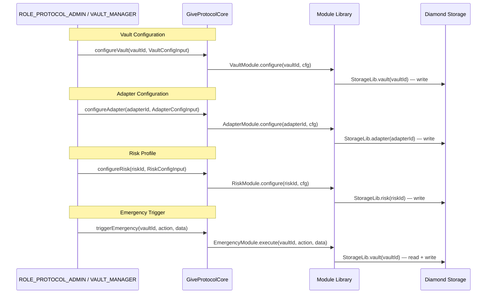
```mermaid
sequenceDiagram
    participant Admin as ROLE_PROTOCOL_ADMIN / VAULT_MANAGER
    participant Core as GiveProtocolCore
    participant Module as Module Library
    participant DS as Diamond Storage

    Note over Admin, Core: Vault Configuration
    Admin->>Core: configureVault(vaultId, VaultConfigInput)
    Core->>Module: VaultModule.configure(vaultId, cfg)
    Module->>DS: StorageLib.vault(vaultId) — write

    Note over Admin, Core: Adapter Configuration
    Admin->>Core: configureAdapter(adapterId, AdapterConfigInput)
    Core->>Module: AdapterModule.configure(adapterId, cfg)
    Module->>DS: StorageLib.adapter(adapterId) — write

    Note over Admin, Core: Risk Profile
    Admin->>Core: configureRisk(riskId, RiskConfigInput)
    Core->>Module: RiskModule.configure(riskId, cfg)
    Module->>DS: StorageLib.risk(riskId) — write

    Note over Admin, Core: Emergency Trigger
    Admin->>Core: triggerEmergency(vaultId, action, data)
    Core->>Module: EmergencyModule.execute(vaultId, action, data)
    Module->>DS: StorageLib.vault(vaultId) — read + write
```

Source: `src/core/GiveProtocolCore.sol`

#### PayoutRouter

Pull-based yield distribution hub. Uses a per-share accumulator model: when `recordYield` is called, `accumulatedYieldPerShare` advances by `deltaPerShare`. Each user's claimable yield is `(accumulatedYieldPerShare - userYieldDebt) * userShares`, computed in O(1) at claim time with no loops over recipients.

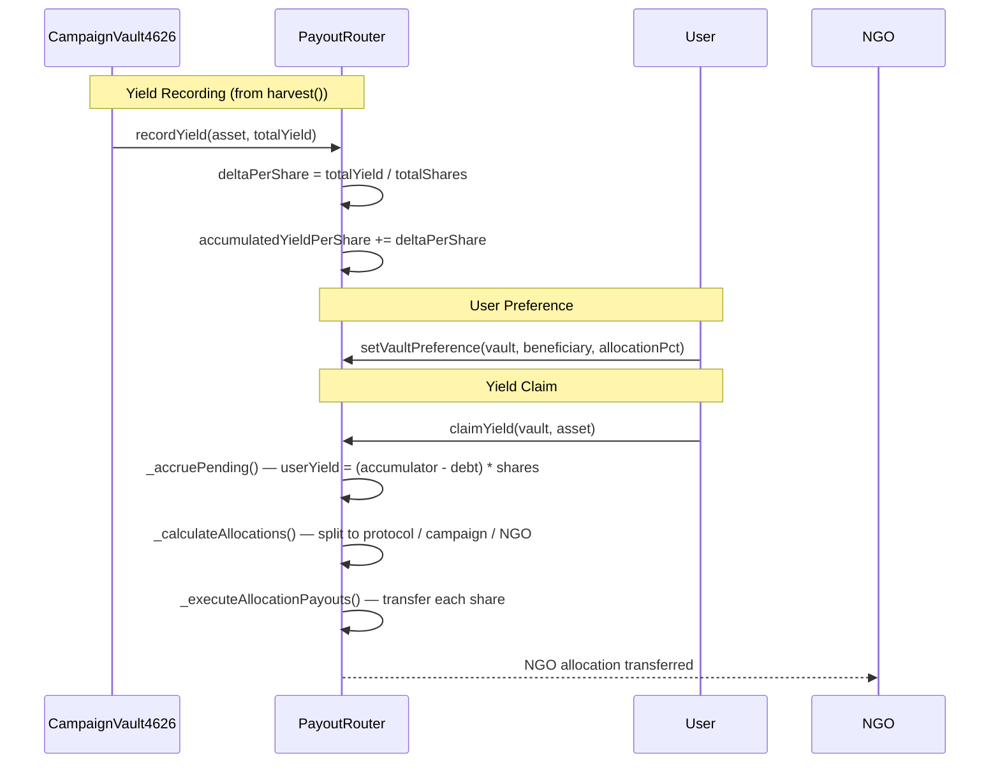
```mermaid
sequenceDiagram
    participant Vault as CampaignVault4626
    participant PR as PayoutRouter
    participant User
    participant NGO

    Note over Vault, PR: Yield Recording (from harvest())
    Vault->>PR: recordYield(asset, totalYield)
    PR->>PR: deltaPerShare = totalYield / totalShares
    PR->>PR: accumulatedYieldPerShare += deltaPerShare

    Note over User, PR: User Preference
    User->>PR: setVaultPreference(vault, beneficiary, allocationPct)

    Note over User, PR: Yield Claim
    User->>PR: claimYield(vault, asset)
    PR->>PR: _accruePending() — userYield = (accumulator - debt) * shares
    PR->>PR: _calculateAllocations() — split to protocol / campaign / NGO
    PR->>PR: _executeAllocationPayouts() — transfer each share
    PR-->>NGO: NGO allocation transferred
```

**Three-way yield split:**

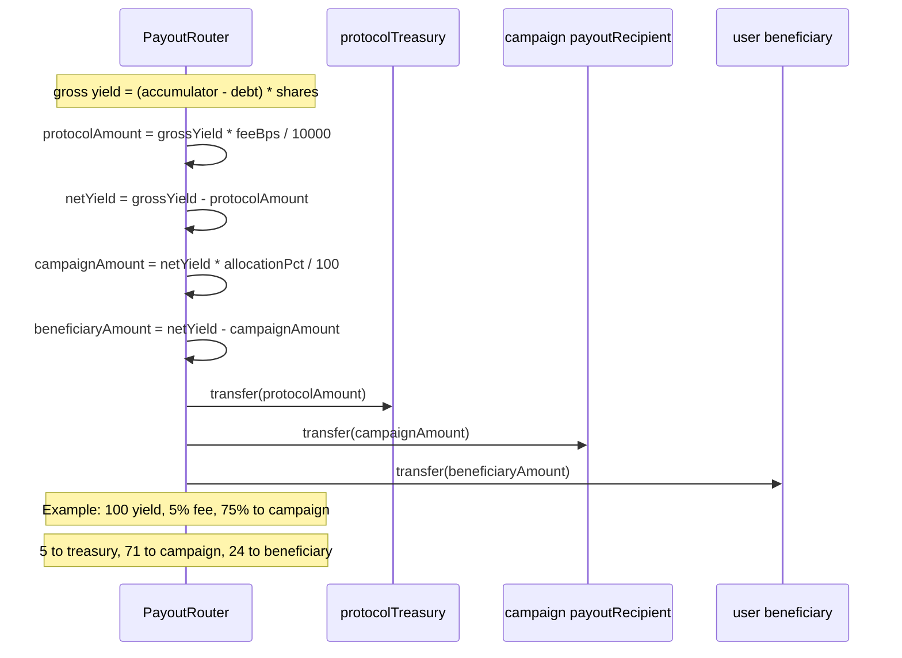
```mermaid
sequenceDiagram
    participant PR as PayoutRouter
    participant Treasury as protocolTreasury
    participant Campaign as campaign payoutRecipient
    participant Beneficiary as user beneficiary

    Note over PR: gross yield = (accumulator - debt) * shares
    PR->>PR: protocolAmount = grossYield * feeBps / 10000
    PR->>PR: netYield = grossYield - protocolAmount
    PR->>PR: campaignAmount = netYield * allocationPct / 100
    PR->>PR: beneficiaryAmount = netYield - campaignAmount
    PR->>Treasury: transfer(protocolAmount)
    PR->>Campaign: transfer(campaignAmount)
    PR->>Beneficiary: transfer(beneficiaryAmount)
    Note over PR: Example: 100 yield, 5% fee, 75% to campaign
    Note over PR: 5 to treasury, 71 to campaign, 24 to beneficiary
```

| `allocationPercentage` | Campaign share | Beneficiary share | Beneficiary required |
| ---------------------- | -------------- | ----------------- | -------------------- |
| `100` (default)        | 100% of net    | 0%                | No                   |
| `75`                   | 75% of net     | 25% of net        | Yes                  |
| `50`                   | 50% of net     | 50% of net        | Yes                  |

**Fee timelock:**

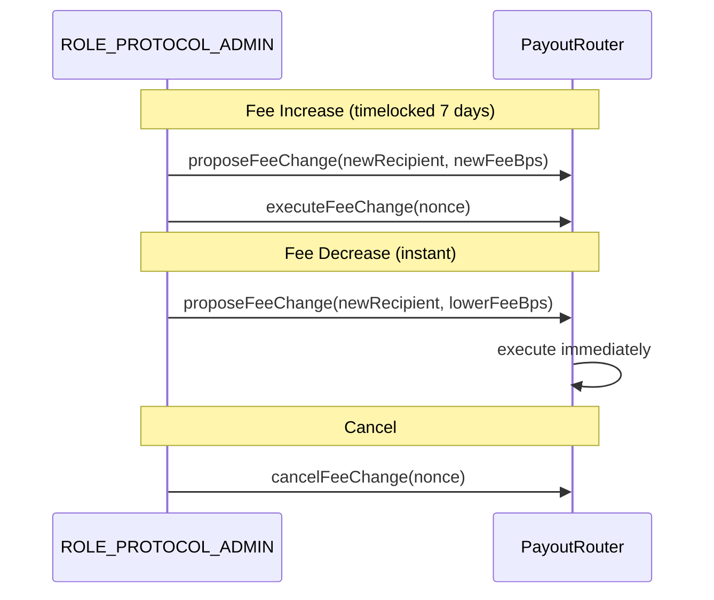
```mermaid
sequenceDiagram
    participant Admin as ROLE_PROTOCOL_ADMIN
    participant PR as PayoutRouter

    Note over Admin, PR: Fee Increase (timelocked 7 days)
    Admin->>PR: proposeFeeChange(newRecipient, newFeeBps)
    Admin->>PR: executeFeeChange(nonce)

    Note over Admin, PR: Fee Decrease (instant)
    Admin->>PR: proposeFeeChange(newRecipient, lowerFeeBps)
    PR->>PR: execute immediately

    Note over Admin, PR: Cancel
    Admin->>PR: cancelFeeChange(nonce)
```

Source: `src/payout/PayoutRouter.sol`

---

### Layer 2 — Vaults

| Contract               | Type   | Purpose                                                          |
| ---------------------- | ------ | ---------------------------------------------------------------- |
| `GiveVault4626`        | UUPS   | Base ERC-4626 vault with yield harvesting and emergency controls |
| `CampaignVault4626`    | UUPS   | Campaign-specific vault with fundraising limits                  |
| `CampaignVaultFactory` | Normal | Deploys `CampaignVault4626` as UUPS proxies via CREATE2          |
| `StrategyManager`      | Normal | Per-vault adapter controller with rebalancing                    |

#### CampaignVaultFactory

Deploys `CampaignVault4626` instances as UUPS proxies using CREATE2, making vault addresses deterministic from `(campaignId, strategyId, lockProfile)`. Wires the vault to `CampaignRegistry` and `PayoutRouter` at deploy time.

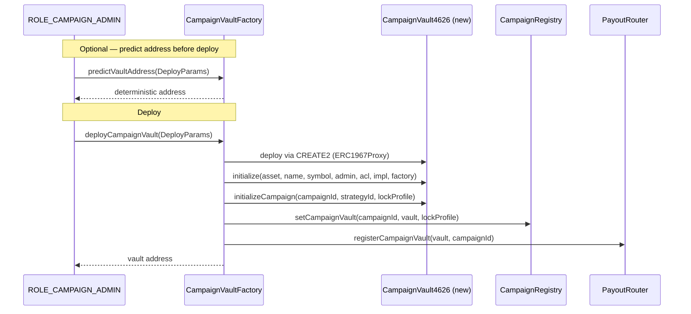
```mermaid
sequenceDiagram
    participant Admin as ROLE_CAMPAIGN_ADMIN
    participant Factory as CampaignVaultFactory
    participant Proxy as CampaignVault4626 (new)
    participant CR as CampaignRegistry
    participant PR as PayoutRouter

    Note over Admin, Factory: Optional — predict address before deploy
    Admin->>Factory: predictVaultAddress(DeployParams)
    Factory-->>Admin: deterministic address

    Note over Admin, Factory: Deploy
    Admin->>Factory: deployCampaignVault(DeployParams)
    Factory->>Proxy: deploy via CREATE2 (ERC1967Proxy)
    Factory->>Proxy: initialize(asset, name, symbol, admin, acl, impl, factory)
    Factory->>Proxy: initializeCampaign(campaignId, strategyId, lockProfile)
    Factory->>CR: setCampaignVault(campaignId, vault, lockProfile)
    Factory->>PR: registerCampaignVault(vault, campaignId)
    Factory-->>Admin: vault address
```

Source: `src/factory/CampaignVaultFactory.sol`

#### GiveVault4626 / CampaignVault4626

`GiveVault4626` is the base ERC-4626 vault. It extends the standard with a cash buffer (percentage held liquid), a bound yield adapter, emergency controls, and a harvest function that pushes accrued yield to `PayoutRouter`. `CampaignVault4626` extends it with campaign metadata (`campaignId`, `strategyId`, `lockProfile`).

**Deposit / Withdraw:**

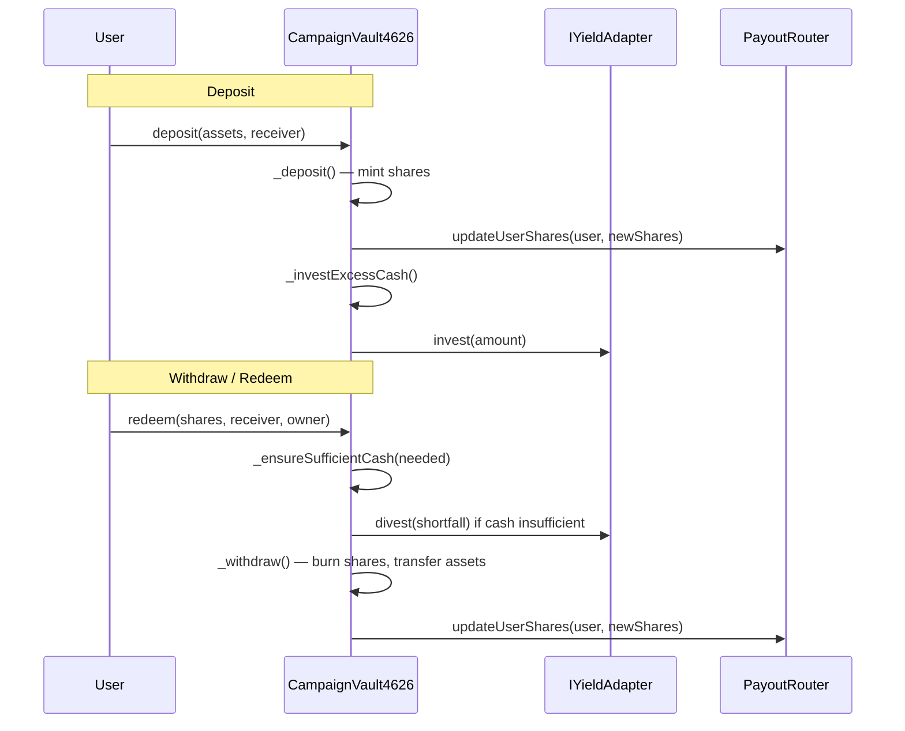
```mermaid
sequenceDiagram
    participant User
    participant Vault as CampaignVault4626
    participant Adapter as IYieldAdapter
    participant PR as PayoutRouter

    Note over User, Vault: Deposit
    User->>Vault: deposit(assets, receiver)
    Vault->>Vault: _deposit() — mint shares
    Vault->>PR: updateUserShares(user, newShares)
    Vault->>Vault: _investExcessCash()
    Vault->>Adapter: invest(amount)

    Note over User, Vault: Withdraw / Redeem
    User->>Vault: redeem(shares, receiver, owner)
    Vault->>Vault: _ensureSufficientCash(needed)
    Vault->>Adapter: divest(shortfall) if cash insufficient
    Vault->>Vault: _withdraw() — burn shares, transfer assets
    Vault->>PR: updateUserShares(user, newShares)
```

**Harvest:**

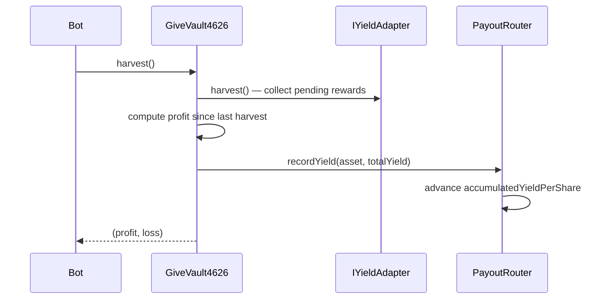
```mermaid
sequenceDiagram
    participant Bot
    participant Vault as GiveVault4626
    participant Adapter as IYieldAdapter
    participant PR as PayoutRouter

    Bot->>Vault: harvest()
    Vault->>Adapter: harvest() — collect pending rewards
    Vault->>Vault: compute profit since last harvest
    Vault->>PR: recordYield(asset, totalYield)
    PR->>PR: advance accumulatedYieldPerShare
    Vault-->>Bot: (profit, loss)
```

**ETH wrapper (WETH vaults):**

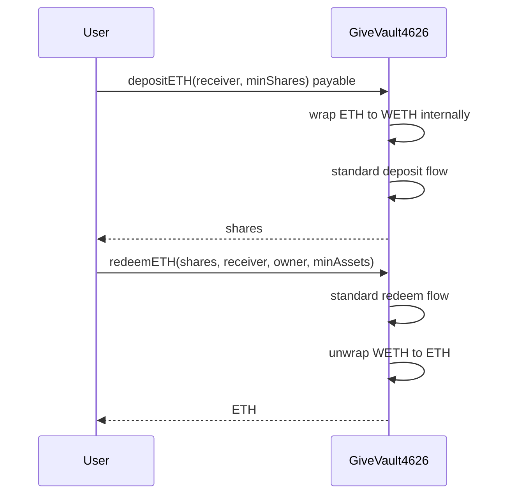
```mermaid
sequenceDiagram
    participant User
    participant Vault as GiveVault4626

    User->>Vault: depositETH(receiver, minShares) payable
    Vault->>Vault: wrap ETH to WETH internally
    Vault->>Vault: standard deposit flow
    Vault-->>User: shares

    User->>Vault: redeemETH(shares, receiver, owner, minAssets)
    Vault->>Vault: standard redeem flow
    Vault->>Vault: unwrap WETH to ETH
    Vault-->>User: ETH
```

Source: `src/vault/GiveVault4626.sol`, `src/vault/CampaignVault4626.sol`

#### StrategyManager

Per-vault controller for adapter lifecycle and operational parameters. Maintains an approved adapter list (max 10), handles rebalancing by comparing `totalAssets()` across adapters (TVL heuristic, not APY), and proxies emergency commands to the vault.

**Adapter management and rebalancing:**

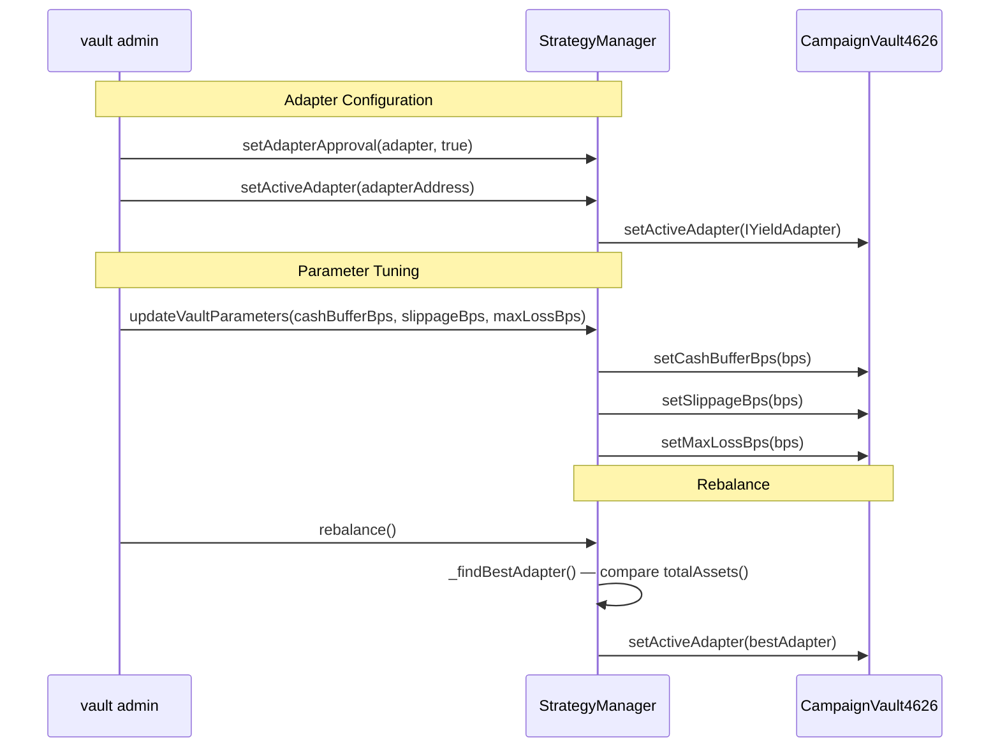
```mermaid
sequenceDiagram
    participant Admin as vault admin
    participant SM as StrategyManager
    participant Vault as CampaignVault4626

    Note over Admin, SM: Adapter Configuration
    Admin->>SM: setAdapterApproval(adapter, true)
    Admin->>SM: setActiveAdapter(adapterAddress)
    SM->>Vault: setActiveAdapter(IYieldAdapter)

    Note over Admin, SM: Parameter Tuning
    Admin->>SM: updateVaultParameters(cashBufferBps, slippageBps, maxLossBps)
    SM->>Vault: setCashBufferBps(bps)
    SM->>Vault: setSlippageBps(bps)
    SM->>Vault: setMaxLossBps(bps)

    Note over SM, Vault: Rebalance
    Admin->>SM: rebalance()
    SM->>SM: _findBestAdapter() — compare totalAssets()
    SM->>Vault: setActiveAdapter(bestAdapter)
```

**Emergency proxy:**

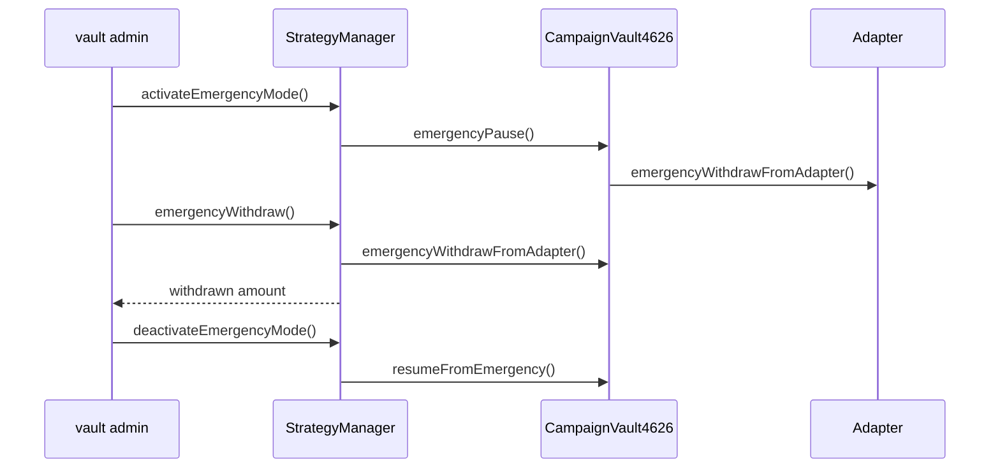
```mermaid
sequenceDiagram
    participant Admin as vault admin
    participant SM as StrategyManager
    participant Vault as CampaignVault4626
    participant Adapter

    Admin->>SM: activateEmergencyMode()
    SM->>Vault: emergencyPause()
    Vault->>Adapter: emergencyWithdrawFromAdapter()

    Admin->>SM: emergencyWithdraw()
    SM->>Vault: emergencyWithdrawFromAdapter()
    SM-->>Admin: withdrawn amount

    Admin->>SM: deactivateEmergencyMode()
    SM->>Vault: resumeFromEmergency()
```

Source: `src/manager/StrategyManager.sol`

#### EmergencyModule

Last line of defense when a breach or exploit is suspected. Called via `GiveProtocolCore.triggerEmergency()`. Three actions are available: `Pause`, `Withdraw`, and `Resume`. When `Withdraw` is executed, all funds are pulled from the adapter back into the vault. Users can still redeem normally within a 24-hour grace period; after expiry, `emergencyWithdrawUser` handles pro-rata returns.

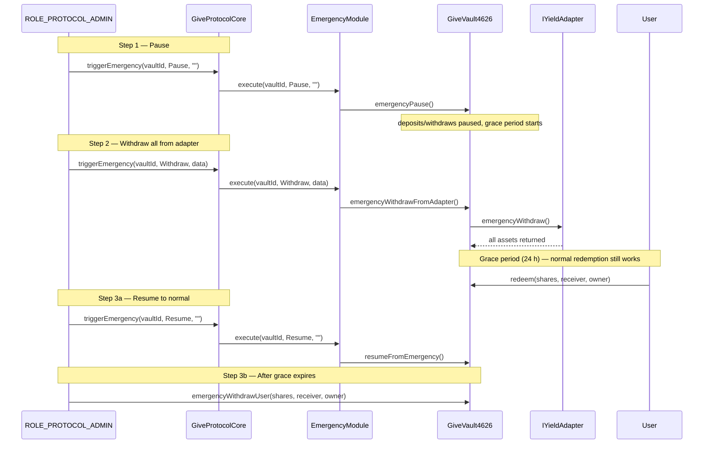
```mermaid
sequenceDiagram
    participant Admin as ROLE_PROTOCOL_ADMIN
    participant Core as GiveProtocolCore
    participant EM as EmergencyModule
    participant Vault as GiveVault4626
    participant Adapter as IYieldAdapter
    participant User

    Note over Admin, Core: Step 1 — Pause
    Admin->>Core: triggerEmergency(vaultId, Pause, "")
    Core->>EM: execute(vaultId, Pause, "")
    EM->>Vault: emergencyPause()
    Note over Vault: deposits/withdraws paused, grace period starts

    Note over Admin, Core: Step 2 — Withdraw all from adapter
    Admin->>Core: triggerEmergency(vaultId, Withdraw, data)
    Core->>EM: execute(vaultId, Withdraw, data)
    EM->>Vault: emergencyWithdrawFromAdapter()
    Vault->>Adapter: emergencyWithdraw()
    Adapter-->>Vault: all assets returned

    Note over User, Vault: Grace period (24 h) — normal redemption still works
    User->>Vault: redeem(shares, receiver, owner)

    Note over Admin, Core: Step 3a — Resume to normal
    Admin->>Core: triggerEmergency(vaultId, Resume, "")
    Core->>EM: execute(vaultId, Resume, "")
    EM->>Vault: resumeFromEmergency()

    Note over Admin, Vault: Step 3b — After grace expires
    Admin->>Vault: emergencyWithdrawUser(shares, receiver, owner)
```

Source: `src/modules/EmergencyModule.sol`, `src/core/GiveProtocolCore.sol`

---

### Layer 3 — Yield Adapters

| Contract                | Kind                 | Protocol                                                   |
| ----------------------- | -------------------- | ---------------------------------------------------------- |
| `AaveAdapter`           | `BalanceGrowth`      | Aave V3 — aTokens grow autonomously                        |
| `CompoundingAdapter`    | `CompoundingValue`   | Generic compounding (sUSDe, cTokens)                       |
| `GrowthAdapter`         | `BalanceGrowth`      | Generic balance-growth pattern                             |
| `PendleAdapter`         | `FixedMaturityToken` | Pendle PT integration (standard and yield-bearing markets) |
| `PTAdapter`             | `FixedMaturityToken` | Principal token base                                       |
| `ClaimableYieldAdapter` | `ClaimableYield`     | Manual yield claiming (liquidity mining)                   |
| `ManualManageAdapter`   | `Manual`             | Operator-controlled off-chain positions                    |

| Kind                 | How Yield Works                            | `harvest()` behaviour                  | Example Protocols               |
| -------------------- | ------------------------------------------ | -------------------------------------- | ------------------------------- |
| `CompoundingValue`   | Balance constant, exchange rate rises      | Returns unrealised gain                | wstETH, sUSDe, Compound cTokens |
| `BalanceGrowth`      | Token balance grows over time              | Returns balance delta                  | Aave aTokens                    |
| `FixedMaturityToken` | PT tokens mature at face value             | Always returns `(0, 0)` until maturity | Pendle PT                       |
| `ClaimableYield`     | Yield queued externally, claimed manually  | Triggers external claim                | Liquidity mining rewards        |
| `Manual`             | Off-chain management, on-chain attestation | Operator-reported                      | Structured products             |

> **PT vault note:** Pendle PT adapters return `(0, 0)` from `harvest()` for their entire lifetime. Yield is embedded in the PT discount and realised only at maturity. Early redemption is blocked by AMM spread (~6.4%) exceeding `maxLossBps`. See `CLAUDE.md` for the proposed maturity-lock fix.

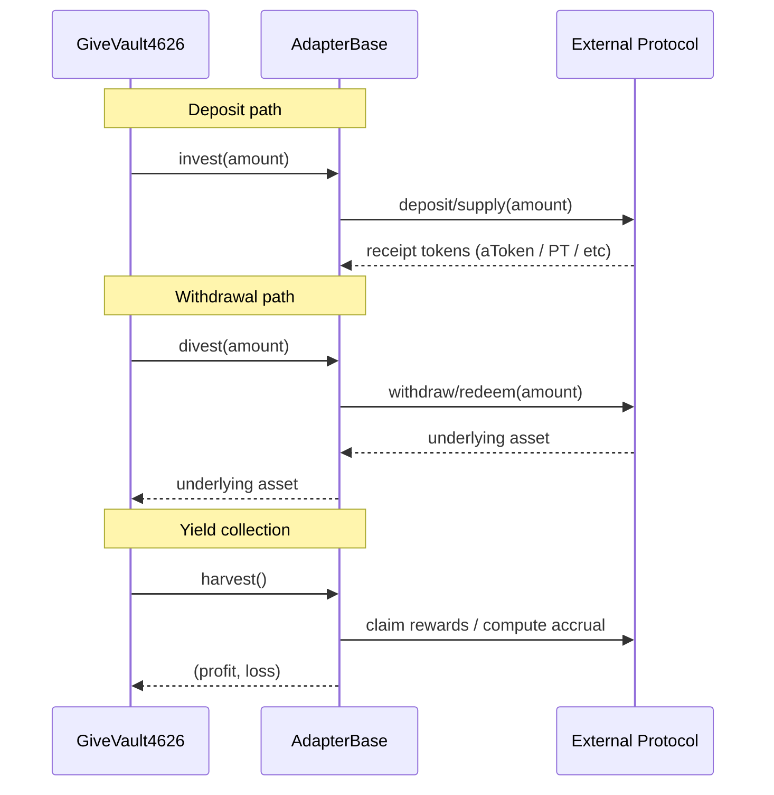
```mermaid
sequenceDiagram
    participant Vault as GiveVault4626
    participant Adapter as AdapterBase
    participant Protocol as External Protocol

    Note over Vault, Adapter: Deposit path
    Vault->>Adapter: invest(amount)
    Adapter->>Protocol: deposit/supply(amount)
    Protocol-->>Adapter: receipt tokens (aToken / PT / etc)

    Note over Vault, Adapter: Withdrawal path
    Vault->>Adapter: divest(amount)
    Adapter->>Protocol: withdraw/redeem(amount)
    Protocol-->>Adapter: underlying asset
    Adapter-->>Vault: underlying asset

    Note over Vault, Adapter: Yield collection
    Vault->>Adapter: harvest()
    Adapter->>Protocol: claim rewards / compute accrual
    Adapter-->>Vault: (profit, loss)
```

Source: `src/adapters/`

---

## Module Libraries

Six stateless library modules delegate from `GiveProtocolCore`. All state is written through `StorageLib` into diamond storage.

| Module            | Responsibility                                   |
| ----------------- | ------------------------------------------------ |
| `VaultModule`     | Cash buffer, slippage, max loss configuration    |
| `AdapterModule`   | Adapter registration and validation              |
| `DonationModule`  | Donation routing and beneficiary management      |
| `RiskModule`      | LTV, liquidation thresholds, caps, risk profiles |
| `EmergencyModule` | Emergency pause, grace period, user withdrawal   |
| `SyntheticModule` | Synthetic position management                    |

---

## Key Design Patterns

### Diamond Storage

All protocol state lives in a single `GiveStorage.Store` struct, accessed exclusively through `StorageLib` helpers. This eliminates storage slot collisions across upgrades.

```solidity
// All contracts access state via typed accessors
StorageLib.vault(vaultId)            // returns VaultConfig storage ref
StorageLib.adapter(adapterId)        // returns AdapterConfig storage ref
StorageLib.ensureVaultActive(id)     // accessor + validation in one call
```

### Pull-Based Yield Accumulator

Yield is never pushed to all recipients in a loop. The accumulator advances once per `recordYield` call; each user's pending amount is computed in O(1) at claim time.

```
accumulatedYieldPerShare += totalYield / totalShares   // on recordYield
claimable = (accumulatedYieldPerShare - userDebt) * userShares  // on claimYield
```

### Adapter Binding

Adapters are permanently bound to a single vault at deploy time via immutables. The `onlyVault` modifier enforces this binding on every operation.

```solidity
abstract contract AdapterBase {
    bytes32 immutable public adapterId;
    address immutable public adapterVault; // set once, never changes

    modifier onlyVault() {
        require(msg.sender == adapterVault, "only bound vault");
        _;
    }
}
```

---

## Role System

All access control flows through `ACLManager`. No standalone `Ownable`.

```
ROLE_SUPER_ADMIN          Root role, grants all others
ROLE_UPGRADER             Authorize UUPS upgrades
ROLE_PROTOCOL_ADMIN       Fees, treasury, protocol parameters
ROLE_STRATEGY_ADMIN       Register and update strategies
ROLE_CAMPAIGN_ADMIN       Approve and reject campaigns
ROLE_CAMPAIGN_CURATOR     Manage campaign stake escrow
ROLE_CHECKPOINT_COUNCIL   Resolve checkpoint status transitions
VAULT_MANAGER_ROLE        Configure vault adapters and settings
```

Two-step admin transfer prevents accidental privilege loss.

---

## Development

### Setup

```bash
forge install
cp .env.example .env
forge build
forge test
```

### Project Structure

```
src/
├── governance/       ACLManager
├── core/             GiveProtocolCore
├── registry/         CampaignRegistry, StrategyRegistry
├── donation/         NGORegistry
├── vault/            GiveVault4626, CampaignVault4626, VaultTokenBase
├── factory/          CampaignVaultFactory
├── payout/           PayoutRouter
├── manager/          StrategyManager
├── adapters/         AaveAdapter, adapter kinds (6 types)
├── modules/          VaultModule, AdapterModule, DonationModule,
│                     RiskModule, EmergencyModule, SyntheticModule
├── storage/          GiveStorage, StorageLib, StorageKeys
├── types/            GiveTypes (canonical structs and enums)
├── interfaces/       IACLManager, IYieldAdapter, IWETH
├── utils/            GiveErrors, ACLShim
└── mocks/            MockERC20, MockAavePool, MockYieldAdapter

test/
├── base/             Base01–Base03 (3-phase deployment fixtures)
├── unit/             TestContract01–21 (21 unit test suites)
├── integration/      TestAction01–02 (end-to-end workflows)
├── fork/             ForkTest01–11 (11 live protocol tests)
├── fuzz/             FuzzTest01–04 (property-based tests)
└── invariant/        InvariantTest01–03 + 3 handlers

script/
├── base/             BaseDeployment (JSON persistence, network detection)
├── Deploy01_Infrastructure.s.sol    Phase 1: Core + registries
├── Deploy02_VaultsAndAdapters.s.sol Phase 2: Vaults + adapters
├── Deploy03_Initialize.s.sol        Phase 3: Roles + strategies
├── Upgrade.s.sol                    UUPS upgrade helper
└── operations/
    └── deploy_local_all.sh          Full local deployment orchestration

frontend/
├── test/
│   ├── e2e.test.ts                  Main Vitest runner
│   └── e2e/
│       ├── context.ts               Client setup and deployment loading
│       ├── TestAction00_*.ts        Environment + campaign lifecycle
│       ├── TestAction01_*.ts        Deposit, preference, harvest
│       ├── TestAction02_*.ts        Payout, withdrawal, invariants
│       └── TestAction03_*.ts        Access control + revert paths
├── scripts/
│   ├── viem-smoke.mjs               Lightweight smoke test (local/rpc/fork)
│   └── fork-smoke.sh                Fork Anvil + full lifecycle
├── setup.ts                         Viem client initialization
└── vitest.config.ts

config/
└── chains/
    ├── base.json                    Base mainnet (USDC, Aave, wstETH, Pendle)
    ├── arbitrum.json
    ├── optimism.json
    └── local.json

deployments/
├── anvil-latest.json
├── base-mainnet-latest.json
└── [timestamped archives]
```

---

## Testing

### Test Suite Structure

| Category        | Directory           | Files          | Purpose                                                                    | Naming                       |
| --------------- | ------------------- | -------------- | -------------------------------------------------------------------------- | ---------------------------- |
| **Base**        | `test/base/`        | 3              | Deployment fixtures, 3-phase provisioning                                  | `Base0{1,2,3}_Deploy*.t.sol` |
| **Unit**        | `test/unit/`        | 21             | Single-contract functionality                                              | `TestContract{NN}_*.t.sol`   |
| **Integration** | `test/integration/` | 2              | Full workflow cycles                                                       | `TestAction{NN}_*.t.sol`     |
| **Fork**        | `test/fork/`        | 11             | Live protocol interactions + critical-path upgrade validation on Base fork | `ForkTest{NN}_*.fork.t.sol`  |
| **Fuzz**        | `test/fuzz/`        | 4              | Stateless property testing                                                 | `FuzzTest{NN}_*.t.sol`       |
| **Invariant**   | `test/invariant/`   | 3 + 3 handlers | Multi-step protocol invariants                                             | `InvariantTest{NN}_*.t.sol`  |

### Quick Reference

```bash
# Default: unit + integration
forge test -v

# By category
forge test --match-path "test/unit/**" -v
forge test --match-path "test/integration/**" -v
forge test --match-path "test/fork/**" --fork-url $BASE_RPC_URL -v
forge test --match-path "test/fuzz/**" -v --fuzz-seed 0x1337
forge test --match-path "test/invariant/**" -v

# Profiles
FOUNDRY_PROFILE=full forge test              # All suites
FOUNDRY_PROFILE=fork forge test              # Fork only
FOUNDRY_PROFILE=fuzz forge test              # Fuzz only
FOUNDRY_PROFILE=invariant forge test         # Invariant only

# Coverage (unit + integration, no fork/fuzz/invariant)
FOUNDRY_PROFILE=coverage forge coverage --ir-minimum --report summary \
  --no-match-path "test/fork/**:test/fuzz/**:test/invariant/**"

# Specific test
forge test --match-contract TestContract01_ACLManager -v
forge test --match-test test_Case01_deploymentState -v
```

> `--ir-minimum` is permanently required. OZ's `__ERC20_init` uses inline assembly
> that hits the 16-slot stack limit when `optimizer=false, via_ir=false`.

### Coverage Report (Auditor View)

Latest coverage run (provided from `make coverage-summary`):

- Test execution: **438 passed, 0 failed, 0 skipped**
- Global coverage table (includes `script/`, `test/`, and `src/`):
  - **Lines:** 63.35% (2538/4006)
  - **Statements:** 63.36% (2674/4220)
  - **Branches:** 43.81% (283/646)
  - **Functions:** 66.25% (428/646)

For audit interpretation, prioritize **production contracts (`src/`)** and branch depth on
funds-moving paths over the global percentage.

| Audit-critical contract             | Lines  | Statements | Branches | Functions |
| ----------------------------------- | ------ | ---------- | -------- | --------- |
| `src/vault/GiveVault4626.sol`       | 87.88% | 88.76%     | 77.97%   | 81.13%    |
| `src/payout/PayoutRouter.sol`       | 86.33% | 83.95%     | 65.12%   | 90.70%    |
| `src/registry/CampaignRegistry.sol` | 86.97% | 83.75%     | 51.47%   | 86.21%    |
| `src/manager/StrategyManager.sol`   | 77.97% | 76.56%     | 72.73%   | 77.27%    |
| `src/adapters/AaveAdapter.sol`      | 57.80% | 60.94%     | 18.52%   | 44.44%    |

Coverage floor context:

- High branch: `ACLManager` 88.46%, `CampaignVaultFactory` 92.31%, `StorageLib` 100%
- Lower branch pockets are expected in fork-gated or protocol-specific paths (`AaveAdapter`, PT/fixed-maturity branches)

**Reproducible commands (Makefile):**

```bash
# Summary table (auditor-facing quick check)
make coverage-summary

# LCOV artifact for CI/tooling
make coverage

# Full-spectrum LCOV (includes fork/fuzz/invariant)
make coverage-full
```

**Methodology notes:**

- `--ir-minimum` is required for stable coverage compilation with OZ initializers.
- Auditor focus should prioritize `src/` contract metrics and branch coverage on value-flow contracts.
- Fork/fuzz/invariant suites are still separate security validation layers, not denominator contributors to this table.

**Evidence artifacts:**

- `coverage-report.md` (human-readable summary)
- `lcov.info` (machine-readable coverage output from `make coverage`)

### Test Count

- **Unit + Integration (default run):** 438 tests, 0 failed, 0 skipped
- **Fork:** 11 suites (AaveAdapter, Pendle yoUSD/yoETH + maturity, checkpoint voting, multi-vault, campaign lifecycle, depositETH, fork sanity, critical-path upgrade checks)
- **Fuzz:** 4 suites (10,000 runs each)
- **Invariant:** 3 suites (256 runs, depth 500)

### Frontend E2E (Viem + Vitest)

The frontend E2E suite runs against any configured RPC. It completely replaces `.s.sol` operation scripts for lifecycle validation.

```bash
# Run strict E2E suite (primary command)
make vitest

# Override target network/RPC
make frontend-e2e RPC_URL=... DEPLOYMENT_NETWORK=anvil
```

---

## Deployment

### Three-Phase Deployment

```mermaid
flowchart TD
    A[Phase 1: Infrastructure] -->|Deploy01_Infrastructure.s.sol| B[ACLManager<br/>GiveProtocolCore<br/>Registries<br/>PayoutRouter]
    B --> C[Phase 2: Vaults + Adapters]
    C -->|Deploy02_VaultsAndAdapters.s.sol| D[GiveVault4626<br/>CampaignVault4626<br/>All Adapters<br/>StrategyManager]
    D --> E[Phase 3: Initialize]
    E -->|Deploy03_Initialize.s.sol| F[Role Grants<br/>Strategy Activation<br/>Router Wiring]
    F --> G[deployments/network-latest.json]
```

### Local Development

```bash
# Full local deploy (Anvil must be running)
bash script/operations/deploy_local_all.sh

# Or via Make
make deploy-local
```

### Testnet / Mainnet

```bash
# Phase 1
forge script script/Deploy01_Infrastructure.s.sol \
  --rpc-url $BASE_RPC_URL --private-key $PRIVATE_KEY \
  --broadcast --verify

# Phase 2
forge script script/Deploy02_VaultsAndAdapters.s.sol \
  --rpc-url $BASE_RPC_URL --private-key $PRIVATE_KEY \
  --broadcast --verify

# Phase 3
forge script script/Deploy03_Initialize.s.sol \
  --rpc-url $BASE_RPC_URL --private-key $PRIVATE_KEY \
  --broadcast
```

### Upgrade Contracts

```bash
forge script script/Upgrade.s.sol \
  --sig "upgradeACLManager()" \
  --rpc-url $BASE_RPC_URL --private-key $PRIVATE_KEY \
  --broadcast --verify
```

### Deployment Artifacts

All deployments are saved to `deployments/{network}-latest.json` and a timestamped archive. The frontend E2E suite reads these automatically via `DEPLOYMENT_NETWORK` or `DEPLOYMENTS_FILE`.

---

## Static Analysis

Slither is managed via `uv` (Python). Dependencies are declared in `pyproject.toml`.

**Prerequisites:** `uv` — install from [docs.astral.sh/uv](https://docs.astral.sh/uv/getting-started/installation/)

```bash
# Install slither into the project virtualenv (first time only)
make slither-install

# Full report — writes slither-report.json
make slither

# Triage mode — High + Medium detectors only, no JSON output
make slither-triage

# Semgrep (no install needed if semgrep is on PATH)
semgrep --config auto src/
```

Or run directly:

```bash
uv run slither . \
  --compile-force-framework foundry \
  --filter-paths "lib/,node_modules/" \
  --exclude-dependencies \
  --json slither-report.json
```

**Slither findings — full run, all triaged (see `slither/slither-findings.md`):**

| Severity      | Count | Accepted |
| ------------- | ----- | -------- |
| High          | 2     | 0        |
| Medium        | 11    | 0        |
| Low           | 8     | 0        |
| Informational | 6     | 0        |

All 27 grouped findings are dismissed as false positives, intentional patterns, or mock-only code. No code changes required.

---

## Environment

Copy `.env.example` and fill in required values.

**Required for local dev:**

```
PRIVATE_KEY              Deployer/admin signer
USER_PRIVATE_KEY         Test user signer
USDC_ADDRESS             Deployed or mock USDC address
BASE_RPC_URL             RPC endpoint
```

**Pendle adapter (Deploy02_VaultsAndAdapters.s.sol):**

```
PENDLE_ROUTER_ADDRESS    0x888888888889758F76e7103c6CbF23ABbF58F946 (same on all chains)
PENDLE_MARKET_ADDRESS    Pendle market address for the chosen PT
PENDLE_PT_ADDRESS        Principal token address
PENDLE_TOKEN_OUT_ADDRESS SY redemption token. Set to USDC for standard markets (PT-aUSDC).
                         Set to yoUSD / yoETH for yield-bearing markets. Defaults to USDC
                         when unset.
```

Yield-bearing Pendle markets (PT-yoUSD, PT-yoETH) have a SY that accepts USDC/WETH as
deposit input but only releases its own underlying (yoUSD/yoETH) on redemption. The
`tokenOut_` constructor parameter on `PendleAdapter` must match the SY's `getTokensOut()`
list — passing the wrong token causes `SYInvalidTokenOut`.

```bash
# Verify correct tokenOut for a market's SY
cast call <SY_ADDRESS> "getTokensOut()(address[])" --rpc-url $BASE_RPC_URL
```

**Known Base mainnet Pendle markets:**

| Market   | Asset in | Token out                   | Market address      |
| -------- | -------- | --------------------------- | ------------------- |
| PT-yoUSD | USDC     | yoUSD (`0x0000000f2eB9...`) | `0xA679ce6D07cb...` |
| PT-yoETH | WETH     | yoETH (`0x3A43AEC534...`)   | `0x5d6E67FcE4...`   |

**Required for frontend E2E:**

```
DEPLOYMENT_NETWORK       e.g. anvil, base-mainnet
DEPLOYMENTS_FILE         Explicit path override (optional)
EXPECTED_CHAIN_ID        Validation guard (optional)
```

**Protocol parameters:**

```
PROTOCOL_FEE_BPS         100 = 1%
ALLOW_DEFAULT_BROADCAST  false (require explicit signer)
AUTO_REBALANCE_ENABLED   true
REBALANCE_INTERVAL       86400 (1 day in seconds)
```

---

## License

MIT
